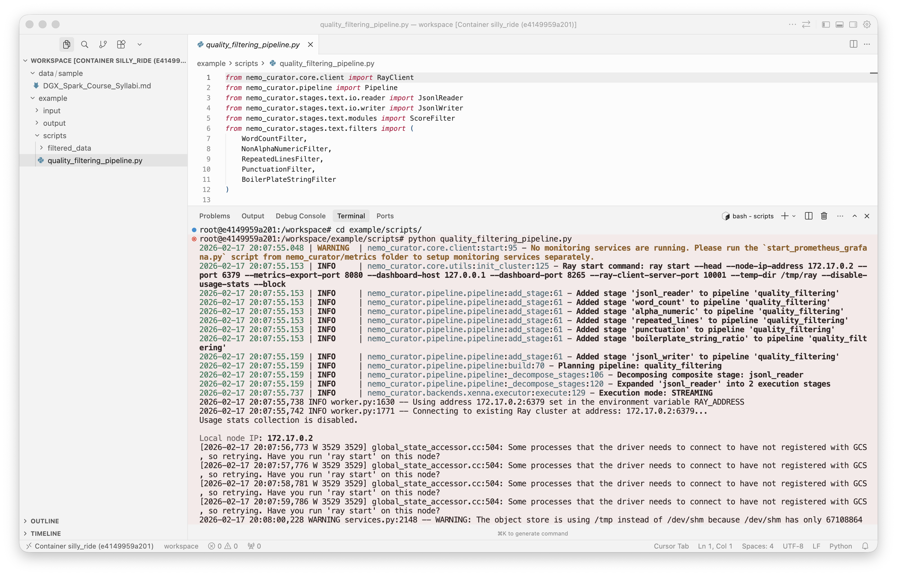

# Nemo Studio Desktop (NSD) for NVIDIA DGX Spark

Many non-technical users are eager to get hands-on experience with state-of-the-art hardware like the NVIDIA DGX Spark, but often struggle to follow tutorials or Jupyter notebook examples. This becomes even more challenging when dealing with end-to-end workflows such as those supported by NVIDIA NeMo.

Nemo Studio Desktop (NSD) acts as your personal DevOps assistant, handling the setup and prerequisites required to work with NVIDIA NeMo. It runs on your local computer and connects to your DGX Spark. After installation, you’ll have a simple, ready-to-use environment that helps you start working with NVIDIA NeMo quickly and confidently.

The image below and following content has been taken from the official NVIDIA NeMo documentation: "The AI agent lifecycle is an end-to-end process for developing and improving AI agents in production applications. NVIDIA NeMo provides tools that enable each step of this workflow, so enterprises can build powerful, secure, and continuously learning agents."
More information about NVIDIA Nemo in [https://www.nvidia.com/en-us/ai-data-science/products/nemo/](https://www.nvidia.com/en-us/ai-data-science/products/nemo/)


The image below shows the main window of Nemo Studio Desktop (NSD). The interface is designed to clearly indicate what needs to be set up at each stage of the NVIDIA NeMo workflow.


## Features (Alpha)

**Note: this preliminary version is designed to be installed on a macOS client computer, not directly on a DGX Spark device.**

- **Remote Connection**: Connects to your DGX Spark and executes the required commands to set up an NVIDIA NeMo environment.
- **End to End Workflow Validation**: NSD prepares and verifies each step of the NVIDIA NeMo workflow..
- **End to End Example**: Once the environment is ready, NSD generates a basic end-to-end example as a starting template.
- **Connects to existing NVIDIA Nemo tools**: NSD Works alongside existing tools such as the NeMo Agent Toolkit (NAT). After the environment is prepared, NSD guides users to these official tools.
- **Learning Reinforcement**: NSD will direct users to the official documentation to help them understand the concepts behind NVIDIA NeMo.

## Workflow detail

### Prepare, Generate Data

The first workflow step prepares the NeMo Curator environment on the remote machine:

- **Left terminal** connects at application start and shows progress of any activity executed in a NeMo workflow setup.Use the **Upload Files** button (below Get Ready 01) to upload your own files or folders to the remote `data/sample` directory.
- **Right terminal** monitor NVDIA containers availability.
- **Get Ready 01**
  - Uploads nemo curator examples (data, scripts) to the remote `example/` folder in DGX Spark.
  - Pulls the `nvcr.io/nvidia/nemo-curator:25.09` image.
  - Runs a new container with the remote project path mounted at `/workspace`, keeping it running in the background.
  - You can now exec into the container and access the examples to get started!



<p align="center">An example of a quality filtering example script</p>

### Select Model

Coming soon.

### Build Agent

Coming soon.

### Connect to Data

Coming soon.

### Guardrail

Coming soon.

### Deploy

Coming soon.

### Monitor/Optimize

Coming soon.

## Prerequisites (any OS)

- **OpenJDK 25** for this project (see below to use another version). **Maven is not required** (Maven Wrapper is included).


| OS      | Install OpenJDK 25        |
| --------- | --------------------------- |
| macOS   | `brew install openjdk@25` |
| Windows | Still not tested          |
| Linux   | Still not tested          |

### Switching to another Java version later

The project uses **`.java-version`** (currently set to **25**). To use a different JDK:

1. **Edit `.java-version`** — change `25` to the version you want (e.g. `21` or `17`).
2. **Install that JDK** if needed (e.g. `brew install openjdk@21` on macOS).
3. **Run the app** with `./run.sh` (macOS/Linux) or `.\run.ps1` (Windows). The run scripts read `.java-version` and set **JAVA_HOME** for that run.

**macOS:** `set-java.sh` uses `/usr/libexec/java_home -v <version>`, so any JDK installed via Homebrew (`openjdk@17`, `openjdk@21`, `openjdk@25`) works after you change `.java-version`.

**Windows:** still not tested.

**Linux:** still not tested.

### Installing and switching multiple OpenJDK versions (OS level)

Ways to have several JDKs installed and switch between them on your machine:

**macOS — Homebrew (simple, no extra tools)**

```bash
# Install several versions (they live side by side)
brew install openjdk@17 openjdk@21 openjdk@25

# See what’s installed and their paths
/usr/libexec/java_home -V

# Use a specific version in the current shell (for this terminal only)
export JAVA_HOME=$(/usr/libexec/java_home -v 25)
export PATH="$JAVA_HOME/bin:$PATH"
```

Then run `./run.sh` or any Maven/Java command; they’ll use that JDK until you close the terminal or change `JAVA_HOME`.

**macOS / Linux — jenv (switch per directory or globally)**

[jenv](https://www.jenv.be/) manages multiple Java versions and can set **JAVA_HOME** automatically per directory (using `.java-version`) or globally.

```bash
# Install jenv (macOS)
brew install jenv
echo 'export PATH="$HOME/.jenv/bin:$PATH"' >> ~/.zshrc
echo 'eval "$(jenv init -)"' >> ~/.zshrc

# Add JDKs (point to Homebrew installs or any JDK path)
jenv add /opt/homebrew/opt/openjdk@25/libexec/openjdk.jdk/Contents/Home
jenv add /opt/homebrew/opt/openjdk@21/libexec/openjdk.jdk/Contents/Home

# List versions
jenv versions

# Use 25 globally, or only in current directory (creates/uses .java-version)
jenv global 25
# or: jenv local 25
```

After `jenv local 25`, opening a terminal in that directory sets **JAVA_HOME** to 25 automatically. This project’s **`.java-version`** is already set to `25`; jenv will pick it up if you use jenv in that directory.

**Any OS — SDKMAN**

[SDKMAN](https://sdkman.io/) installs and switches JDKs (and other tools) from the command line.

```bash
# Install SDKMAN (macOS/Linux)
curl -s "https://get.sdkman.io" | bash
source "$HOME/.sdkman/bin/sdkman-init.sh"

# List available Java versions and install a few
sdk list java
sdk install java 25.0.1-tem
sdk install java 21.0.2-tem

# Use one for current shell
sdk use java 25.0.1-tem

# Or set default
sdk default java 25.0.1-tem
```

**Windows**

- Still not tested

**Linux (Debian/Ubuntu)**

- Still not tested

## Run the application

**No Maven install needed** — use the Maven Wrapper (first run will download Maven and dependencies):

- **macOS / Linux:**
  `./mvnw javafx:run`
  or `./run.sh`
- **Windows (cmd or PowerShell):**
  still not tested

If you have Maven installed, you can still run: `mvn javafx:run`.

First run may take a minute (downloads Maven + JavaFX); later runs are quick.

## Build (optional)

```bash
./mvnw compile
./mvnw package
```

On Windows: still not tested

## Project layout

```
nemostudiodesktop/
├── .java-version              # Java version for this project (edit to switch; currently 25)
├── set-java.sh, set-java.ps1, set-java.cmd   # Set JAVA_HOME from .java-version (used by run scripts)
├── config/
│   └── README.md               # Optional: JDK path (Windows/Linux if auto-detect fails)
├── pom.xml                     # Maven: Java 25, JavaFX 21, JSch
├── mvnw, mvnw.cmd              # Maven Wrapper (no Maven install needed)
├── .mvn/wrapper/
├── run.sh, run.bat, run.ps1
├── README.md
├── LICENSE
├── assets/                     # Docs/assets (e.g. workflow diagram)
└── src/main/
    ├── java/com/nemostudio/ide/
    │   ├── NemoStudioApp.java          # Entry point, scene + WebView background
    │   ├── IdeView.java                # Main layout: menu bar, 8 panels, Get Ready buttons, bottom terminal area
    │   ├── RemoteTerminalPanel.java   # SSH terminal in bottom panel (run scripts on remote)
    │   ├── RemoteFolderWindow.java    # Open Remote Folder: SFTP browse, connect, select path
    │   ├── ConnectWindow.java         # Connect dialog (host, user, password)
    │   ├── WorkflowStepWindow.java    # Workflow menu step windows (tools list)
    │   ├── StatusBarMonitor.java      # Polls connectivity + remote folder path for status bar
    │   ├── ConnectionState.java      # App-wide connected flag
    │   ├── ConnectionStore.java      # Persists host, user, remote folder path (~/.nemostudio)
    │   ├── SecurePasswordStore.java  # Encrypted password store (~/.nemostudio/credentials.enc)
    │   ├── GetReady01.java … GetReady07.java   # Handlers: load and run scripts/GetReadyNN.sh on remote
    └── resources/
        ├── styles/
        │   └── ide.css
        ├── diagram-background.html    # Workflow diagram (loads images/gtcdc25-nemo-diagram.svg)
        ├── images/
        │   └── gtcdc25-nemo-diagram.svg
        ├── scripts/                   # Shell scripts run on remote when Get Ready buttons are pressed
        │   └── GetReady01.sh … GetReady07.sh
        └── icons/
            └── app-icon.png
```
